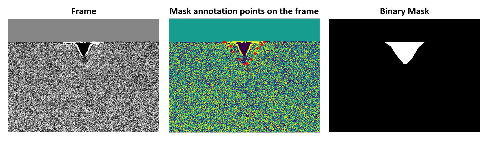

# binary_mask_from_json
One can annotate object masks using online websites like: https://www.robots.ox.ac.uk/~vgg/software/via/via_demo.html. The resulted annotations can be exported as a JSON file. The code in the repository makes the binary mask images from the JSON annotation, which is an input to deep learning structure of segmentation applications. 

### Frame and resulted binary mask from annotation:

